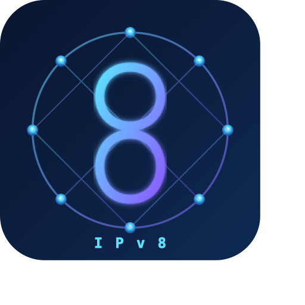

<p align="center">
  
</p>

<h1 align="center">IPv8 Lab</h1>

<p align="center">
  A hands-on playground for <a href="https://www.ietf.org/archive/id/draft-thain-ipv8-00.html"><code>draft-thain-ipv8-00</code></a><br>
  <sub>packet library · 2-tier router sim · Cisco-style CLI · live FRR interop</sub>
</p>

<p align="center">
    
</p>

---

## What is IPv8?

**IPv8** (version number `8` in the IP header) is a proposed successor to IPv4 described in the Internet Draft [`draft-thain-ipv8-00`](https://www.ietf.org/archive/id/draft-thain-ipv8-00.html). Its defining property is a **64-bit address** split into two 32-bit halves:

```
 r . r . r . r . n . n . n . n
 └─────┬─────┘   └─────┬─────┘
     ASN prefix       Host address
    (32 bits)         (32 bits, IPv4-shaped)
```

The routing prefix `r.r.r.r` is the AS number encoded directly in network byte order. The host portion `n.n.n.n` keeps IPv4 semantics, so existing IPv4 routing tables still apply inside an AS. Example: `ASN 64496` encodes as `0.0.251.240`.

Key specs from the draft:

| item            | value                                  |
|-----------------|----------------------------------------|
| IP version      | `8`                                    |
| Address size    | 64 bits                                |
| Header size     | 40 bytes                               |
| IPv4 compat     | yes (`r.r.r.r == 0` → IPv4-only)       |
| Broadcast       | `255.255.255.255.255.255.255.255`      |
| Multicast       | `255.255.xx.xx.xx.xx.xx.xx`            |
| Internal zone   | `127.x.x.x.*`                          |
| DMZ             | `127.127.0.0.*`                        |
| RINE peering    | `100.x.x.x.*`                          |
| Documentation   | `0.0.255.253.*` (ASN 65533)            |

Routing is two-tier: **Tier 1** is an exact lookup on `r.r.r.r`, **Tier 2** is a standard longest-prefix match on `n.n.n.n`. Addresses with `r.r.r.r == 0.0.0.0` bypass Tier 1 entirely — that's how IPv4 co-exists.

The draft also defines companion protocols (OSPF8, BGP8, IS-IS8, DHCP8, ICMPv8, ARP8, DNS8 `A8` records, XLATE8, NetLog8, etc.). This lab implements the on-the-wire data-plane pieces (IPv8, ICMPv8, XLATE8, two-tier routing) and ships a Cisco-style CLI for configuring them.

---

## What this repo gives you

- **`ipv8/`** — pure-Python reference implementation (no third-party deps)
  - `address.py` — 64-bit address, parse/format, reserved-range classification
  - `packet.py`  — 40-byte header encode/decode, one's-complement checksum over the full header
  - `routing.py` — two-tier routing table with longest-prefix match at Tier 2
  - `icmp.py`    — ICMPv8 echo request/reply
  - `xlate.py`   — XLATE8 translator (IPv4 ⇄ IPv8) preserving ToS / flags / frag-offset / identification so round-trips are byte-exact
  - `simulator.py` — userspace multi-AS simulator (Hosts, Routers, Links, Network) with a full tcpdump-style trace
  - `ios.py`     — Cisco-IOS-flavoured CLI (user / priv / config / config-if modes)
  - `socket_api.py` — `sockaddr_in8` struct
  - `constants.py` — `IP_VERSION = 8`, well-known multicast groups, ASN reservations
- **`tests/`** — 78 tests (unit + topology + fuzz + real Docker/FRR)
- **`demos/`** — runnable demo scripts
- **`frr_interop/`** — docker-compose stack with FRR + two netshoot hosts
- **`frr_interop_multi/`** — docker-compose stack with **two FRRs peering via BGP** across a shared `netAB`
- **`cli.py`** — light interactive shell (non-Cisco style, good for quick experiments)

### Features at a glance

- 64-bit address roundtrip, classification, boundary tests (fuzz-validated)
- 40-byte IPv8 header with checksum that covers the full header including reserved bytes
- Two-tier routing (Tier 1 ASN, Tier 2 longest-prefix)
- ICMPv8 echo, TTL decrement, no-route / ttl-exceeded drop handling
- Cisco IOS-flavoured CLI: `enable`, `configure terminal`, `interface`, `ipv8 address`, `ipv8 route`, `no ipv8 route`, `show running-config`, `show ipv8 interface`, `show ipv8 route`, `ping8`, `hostname`, `no shutdown` / `shutdown`, `description`, `end`, `exit`, `write memory`
- Topology coverage: linear 5-router chain, 4-router ring (with reroute after withdrawal), full 4-mesh, hub-and-spoke
- **Real FRR interop**: single-FRR XLATE8 wire-equality test, **two-FRR eBGP multihop** with XLATE8-produced frames traversing both routers

---

## Quick start

### Requirements
- Python 3.9+
- (for FRR interop) Docker Desktop with `docker compose`
- macOS or Linux (tested on macOS arm64)

### 30-second smoke test
```sh
git clone https://github.com/nnnnnnnnnke/ipv8-lab.git
cd ipv8-lab
./run_tests.sh                  # 78 tests, incl. real FRR containers
python3 demos/01_encode_packet.py
```

### Demos
```sh
python3 demos/01_encode_packet.py     # build & hex-dump a single IPv8 packet
python3 demos/02_two_as_ping.py       # 2-AS ping with full tcpdump-style trace
python3 demos/03_xlate_demo.py        # IPv4 → IPv8 → IPv4 round-trip
python3 demos/04_address_zoo.py       # classify every reserved address family
python3 demos/05_five_routers_cli.py  # 5 routers configured via Cisco CLI, host-to-host ping8
```

---

## Configuring a router in Cisco style

Every router is an `ipv8.Router` driven by an `ipv8.IOSCLI` instance. The CLI supports the familiar EXEC / configuration hierarchy:

```
R1> enable
R1# configure terminal
R1(config)# hostname R1
R1(config)# interface Gig0/0
R1(config-if)# ipv8 address 0.0.253.233.10.1.1.1
R1(config-if)# no shutdown
R1(config-if)# exit
R1(config)# interface Gig0/1
R1(config-if)# ipv8 address 0.0.253.233.10.12.0.1
R1(config-if)# no shutdown
R1(config-if)# exit
R1(config)# ipv8 route 0.0.253.233.10.1.1.0/24 interface Gig0/0
R1(config)# ipv8 route 0.0.253.237.0.0.0.0/0 0.0.253.233.10.12.0.2
R1(config)# end
R1# show ipv8 route
Codes: C - connected, S - static
Two-tier IPv8 routing table (draft-thain-ipv8-00)
  C  ASN 65001 10.1.1.1/32 direct  dev Gig0/0
  C  ASN 65001 10.12.0.1/32 direct  dev Gig0/0
  S  ASN 65005 0.0.0.0/0 via 0.0.253.233.10.12.0.2 dev Gig0/1
R1# ping8 0.0.253.237.10.5.1.1
Type escape sequence to abort.
Sending 5, 0-byte IPv8 Echos to 0.0.253.237.10.5.1.1, timeout is 2 seconds:
!!!!!
Success rate is 100 percent (5/5)
```

### Command reference

| mode              | command                                              | purpose                                    |
|-------------------|------------------------------------------------------|--------------------------------------------|
| user EXEC         | `enable`                                             | enter priv EXEC                            |
| user / priv       | `ping8 <addr>`                                       | send 5 ICMPv8 echoes                       |
| user / priv       | `show ipv8 interface [brief]`                        | list interfaces + state                    |
| user / priv       | `show ipv8 route`                                    | print the two-tier routing table           |
| priv              | `show running-config`                                | dump CLI-reconstructible config            |
| priv              | `configure terminal`                                 | enter global config                        |
| global config     | `hostname NAME`                                      | rename device                              |
| global config     | `interface NAME`                                     | enter interface config                     |
| global config     | `ipv8 route PFX/LEN NEXT_HOP`                        | static route via next-hop                  |
| global config     | `ipv8 route PFX/LEN interface IFACE`                 | directly-connected static route            |
| global config     | `no ipv8 route PFX/LEN`                              | remove a route                             |
| global config     | `end` / `exit`                                       | return to priv EXEC                        |
| interface config  | `ipv8 address ADDR`                                  | assign IPv8 address                        |
| interface config  | `no shutdown` / `shutdown`                           | enable / disable interface                 |
| interface config  | `description TEXT`                                   | free-form label                            |
| interface config  | `exit`                                               | leave interface config                     |

---

## FRR interoperability

IPv8 is backwards-compatible with IPv4 whenever `r.r.r.r == 0.0.0.0`. The `frr_interop/` and `frr_interop_multi/` stacks prove this against real FRRouting containers.

### Single-FRR wire equality
```
hostA (198.19.1.10) ── netA ── [FRR] ── netB ── hostB (198.19.2.10)
```
We capture an IPv4 ICMP packet that FRR actually forwarded, feed it through the `XLATE8` library (`v4 → v8 → v4`), and assert byte-equality. We then inject an `XLATE8`-built IPv4 frame at hostA's raw socket and watch FRR forward it to hostB, which replies.

### Two-FRR BGP multihop
```
hostA ─ netA ─ [FRR1 AS 65101] ══BGP══ [FRR2 AS 65102] ─ netB ─ hostB
```
Two FRRouting containers establish an eBGP session over `netAB`, redistribute hostA/hostB subnets, and our XLATE8-produced frames traverse both routers. Tests also sanity-check that bgpd is actually listening on TCP/179 and that `vtysh -c 'show ip route bgp'` shows the learned prefix.

Bring up or tear down:
```sh
cd frr_interop         && docker compose up -d
cd frr_interop_multi   && docker compose up -d
# tests bring them up automatically in setUpClass — no manual step required
```

---

## Architecture at a glance

```
            ┌────────────────── cli.py ───────────────────┐
            │                                             │
            ▼                                             │
        IOSCLI (ios.py)                                   │
            │                                             │
        ┌───┴───┐                                         │
        ▼       ▼                                         │
      Host   Router ─────── rtable ─── TwoTierRoutingTable (routing.py)
        │       │                                         │
        └───┬───┘                                         │
            ▼                                             │
       Network / Link (simulator.py)                      │
            │                                             │
            ▼                                             │
        IPv8Packet (packet.py)   ── checksum16 ──         │
            │            ▲                                │
            │            │                                │
        IPv8Address (address.py)                          │
            │                                             │
            ▼                                             │
        ICMPv8 (icmp.py) · XLATE8 (xlate.py) ─────── raw IPv4 ── FRR
```

---

## Running the tests

```sh
# Full suite (requires Docker for FRR tests; no fallback)
./run_tests.sh

# Fast unit-only (no Docker)
python3 -m unittest discover -t . -s tests \
  -p 'test_[!f]*.py' -p 'test_frr_multihop.py' -k 'not frr'
```

Test categories:

| file                         | focus                                                        |
|------------------------------|--------------------------------------------------------------|
| `test_address.py`            | 64-bit address, reserved classes                             |
| `test_packet.py`             | header encode/decode, checksum                               |
| `test_routing.py`            | two-tier lookup, longest-prefix                              |
| `test_icmp.py`               | ICMPv8 echo                                                  |
| `test_xlate.py`              | IPv4 ⇄ IPv8 round-trip                                       |
| `test_ios.py`                | Cisco CLI mode transitions                                   |
| `test_cli_negative.py`       | 17 adversarial CLI cases                                     |
| `test_simulator.py`          | 2-AS simulator                                               |
| `test_five_routers.py`       | linear 5-router, CLI-driven                                  |
| `test_topology_ring.py`      | 4-router ring, reconvergence                                 |
| `test_topology_mesh.py`      | 4-router full mesh                                           |
| `test_topology_hub.py`       | 1 hub + 6 hosts                                              |
| `test_fuzz.py`               | 1000+ random address / packet round-trips, bit-flip detection|
| `test_frr_interop.py`        | real FRR wire-equality                                       |
| `test_frr_multihop.py`       | two FRRs, eBGP session, XLATE8 multihop                      |

---

## License

MIT — see [LICENSE](LICENSE).

---
---

<p align="center">
  
</p>

<h1 align="center">IPv8 Lab — 日本語版</h1>

## IPv8 とは

**IPv8** は、IETF インターネットドラフト [`draft-thain-ipv8-00`](https://www.ietf.org/archive/id/draft-thain-ipv8-00.html) で提案されている IPv4 の後継プロトコルです。IP ヘッダのバージョン番号は `8` で、最大の特徴は **64-bit アドレス** を 32-bit ずつの 2 つに分けた構造にあります。

```
 r . r . r . r . n . n . n . n
 └─────┬─────┘   └─────┬─────┘
    ASN プレフィックス  ホスト部
      (32 bit)        (32 bit、IPv4 と同形)
```

`r.r.r.r` は AS 番号をネットワークバイトオーダーでそのまま符号化したもの、`n.n.n.n` は従来の IPv4 のセマンティクスをそのまま残しています。例えば `ASN 64496` は `0.0.251.240` と符号化されます。

ドラフトが定める主要な値：

| 項目              | 値                                    |
|-------------------|---------------------------------------|
| バージョン        | `8`                                   |
| アドレス長        | 64 bit                                |
| ヘッダ長          | 40 byte                               |
| IPv4 互換         | あり（`r.r.r.r == 0` → 純 IPv4）      |
| ブロードキャスト  | `255.255.255.255.255.255.255.255`     |
| マルチキャスト    | `255.255.xx.xx.xx.xx.xx.xx`           |
| 内部ゾーン        | `127.x.x.x.*`                         |
| DMZ               | `127.127.0.0.*`                       |
| RINE ピアリング   | `100.x.x.x.*`                         |
| ドキュメント用    | `0.0.255.253.*`（ASN 65533）          |

ルーティングは **二階層構造** で、Tier 1 は `r.r.r.r` による厳密一致、Tier 2 は `n.n.n.n` に対する最長一致です。`r.r.r.r == 0.0.0.0` のときは Tier 1 をスキップし、既存の IPv4 ルーティング表がそのまま適用されるため、IPv4 と共存できます。

ドラフトには OSPF8、BGP8、IS-IS8、DHCP8、ICMPv8、ARP8、DNS8（`A8` レコード）、XLATE8、NetLog8 などの補助プロトコルも含まれます。本リポジトリは **データプレーン部分（IPv8 / ICMPv8 / XLATE8 / 二階層ルーティング）を実装**し、Cisco 風 CLI で設定できる形にしています。

---

## 本リポジトリで出来ること

- **`ipv8/`** — 依存ゼロの純 Python 実装
  - `address.py` — 64-bit アドレスの生成・パース・分類
  - `packet.py`  — 40 byte ヘッダの encode/decode、全ヘッダを対象とするチェックサム
  - `routing.py` — 二階層ルーティング表（Tier 2 は最長一致）
  - `icmp.py`    — ICMPv8 echo request/reply
  - `xlate.py`   — XLATE8 変換（IPv4 ⇄ IPv8）、ToS / flags / フラグメントオフセット / 識別子を保持しバイト単位で往復一致
  - `simulator.py` — Host / Router / Link / Network を備えたユーザランド複数 AS シミュレータ、tcpdump 風トレース付き
  - `ios.py`     — Cisco IOS 風 CLI（user / priv / config / config-if モード）
  - `socket_api.py` — `sockaddr_in8` 相当の構造体
  - `constants.py` — `IP_VERSION = 8`、既知マルチキャスト、予約 ASN
- **`tests/`** — 78 テスト（単体・トポロジ・ファズ・実 Docker/FRR）
- **`demos/`** — すぐ実行できるデモ
- **`frr_interop/`** — docker-compose で FRR 1 台 + netshoot ホスト 2 台
- **`frr_interop_multi/`** — FRR 2 台が **BGP** でピアリングする構成
- **`cli.py`** — 簡易対話シェル

### 機能の概要

- 64-bit アドレスの往復・分類・境界ケース（ファジングで検証済み）
- 40 byte ヘッダのチェックサムは予約領域も含む全 40 byte をカバー
- 二階層ルーティング（Tier 1 ASN、Tier 2 最長一致）
- ICMPv8 echo、TTL 減算、`no-route` / `ttl-exceeded` のドロップ処理
- Cisco IOS 風 CLI：`enable` / `configure terminal` / `interface` / `ipv8 address` / `ipv8 route` / `no ipv8 route` / `show running-config` / `show ipv8 interface` / `show ipv8 route` / `ping8` / `hostname` / `no shutdown` / `shutdown` / `description` / `end` / `exit` / `write memory`
- トポロジ網羅：直列 5 台、リング 4 台（経路引き剥がし後の再収束）、フルメッシュ 4 台、ハブ＆スポーク
- **実 FRR との相互運用**：単一 FRR でのワイヤレベルバイト一致、**2 台 FRR で eBGP** を張って XLATE8 生成フレームが通過

---

## クイックスタート

### 必要環境
- Python 3.9 以上
- （FRR 相互運用テスト用）Docker Desktop と `docker compose`
- macOS または Linux（macOS arm64 で動作確認）

### 30 秒動作確認
```sh
git clone https://github.com/nnnnnnnnnke/ipv8-lab.git
cd ipv8-lab
./run_tests.sh                  # 78 テスト、実 FRR コンテナ含む
python3 demos/01_encode_packet.py
```

### デモ
```sh
python3 demos/01_encode_packet.py     # 単一 IPv8 パケットの生成と hex ダンプ
python3 demos/02_two_as_ping.py       # 2 AS 跨ぎ ping と tcpdump 風トレース
python3 demos/03_xlate_demo.py        # IPv4 → IPv8 → IPv4 の往復
python3 demos/04_address_zoo.py       # 予約アドレス全種の分類
python3 demos/05_five_routers_cli.py  # 5 台を Cisco CLI で設定、host 間 ping8
```

---

## Cisco 風 CLI でルータを設定する

各ルータは `ipv8.Router` と `ipv8.IOSCLI` をペアで使います。IOS と同じ EXEC / config 階層が利用できます。

```
R1> enable
R1# configure terminal
R1(config)# hostname R1
R1(config)# interface Gig0/0
R1(config-if)# ipv8 address 0.0.253.233.10.1.1.1
R1(config-if)# no shutdown
R1(config-if)# exit
R1(config)# interface Gig0/1
R1(config-if)# ipv8 address 0.0.253.233.10.12.0.1
R1(config-if)# no shutdown
R1(config-if)# exit
R1(config)# ipv8 route 0.0.253.233.10.1.1.0/24 interface Gig0/0
R1(config)# ipv8 route 0.0.253.237.0.0.0.0/0 0.0.253.233.10.12.0.2
R1(config)# end
R1# show ipv8 route
Codes: C - connected, S - static
Two-tier IPv8 routing table (draft-thain-ipv8-00)
  C  ASN 65001 10.1.1.1/32 direct  dev Gig0/0
  C  ASN 65001 10.12.0.1/32 direct  dev Gig0/0
  S  ASN 65005 0.0.0.0/0 via 0.0.253.233.10.12.0.2 dev Gig0/1
R1# ping8 0.0.253.237.10.5.1.1
Type escape sequence to abort.
Sending 5, 0-byte IPv8 Echos to 0.0.253.237.10.5.1.1, timeout is 2 seconds:
!!!!!
Success rate is 100 percent (5/5)
```

### コマンドリファレンス

| モード            | コマンド                                             | 用途                                     |
|-------------------|------------------------------------------------------|------------------------------------------|
| user EXEC         | `enable`                                             | priv EXEC へ移行                         |
| user / priv       | `ping8 <addr>`                                       | ICMPv8 echo を 5 回送出                  |
| user / priv       | `show ipv8 interface [brief]`                        | インターフェース一覧                     |
| user / priv       | `show ipv8 route`                                    | 二階層ルーティング表を表示               |
| priv              | `show running-config`                                | 現在の設定を CLI 形式で出力              |
| priv              | `configure terminal`                                 | グローバル config へ                     |
| global config     | `hostname NAME`                                      | ホスト名変更                             |
| global config     | `interface NAME`                                     | インターフェース config へ               |
| global config     | `ipv8 route PFX/LEN NEXT_HOP`                        | ネクストホップ経由の static route        |
| global config     | `ipv8 route PFX/LEN interface IFACE`                 | 直接接続の static route                  |
| global config     | `no ipv8 route PFX/LEN`                              | ルート削除                               |
| global config     | `end` / `exit`                                       | priv EXEC へ戻る                         |
| interface config  | `ipv8 address ADDR`                                  | IPv8 アドレス設定                        |
| interface config  | `no shutdown` / `shutdown`                           | インターフェース有効/無効                |
| interface config  | `description TEXT`                                   | 任意ラベル                               |
| interface config  | `exit`                                               | interface config を抜ける                |

---

## FRR 相互運用

IPv8 は `r.r.r.r == 0.0.0.0` のとき IPv4 と下位互換です。`frr_interop/` と `frr_interop_multi/` の 2 つの compose スタックで実証しています。

### 単一 FRR バイト一致試験
```
hostA (198.19.1.10) ── netA ── [FRR] ── netB ── hostB (198.19.2.10)
```
FRR が実際に転送した IPv4 ICMP を tcpdump でキャプチャし、`XLATE8` で `v4 → v8 → v4` に往復させ、バイト等価であることを検証します。さらに `XLATE8` が生成した IPv4 フレームを hostA の raw ソケットから注入し、FRR を経由して hostB から echo reply が返ることを確認します。

### FRR 2 台 + eBGP 多段構成
```
hostA ─ netA ─ [FRR1 AS 65101] ══BGP══ [FRR2 AS 65102] ─ netB ─ hostB
```
FRR を 2 台起動し `netAB` 上で eBGP セッションを確立、各 AS のサブネットを相互に広告します。XLATE8 生成フレームが両ルータを跨いで往復することを確認し、bgpd が TCP/179 で実際に LISTEN しているか、`vtysh -c 'show ip route bgp'` に学習経路が入っているかも検証します。

起動・停止：
```sh
cd frr_interop         && docker compose up -d
cd frr_interop_multi   && docker compose up -d
# テストは setUpClass で自動起動するため、手動で上げる必要はありません
```

---

## アーキテクチャ俯瞰

```
            ┌────────────────── cli.py ───────────────────┐
            │                                             │
            ▼                                             │
        IOSCLI (ios.py)                                   │
            │                                             │
        ┌───┴───┐                                         │
        ▼       ▼                                         │
      Host   Router ─────── rtable ─── TwoTierRoutingTable (routing.py)
        │       │                                         │
        └───┬───┘                                         │
            ▼                                             │
       Network / Link (simulator.py)                      │
            │                                             │
            ▼                                             │
        IPv8Packet (packet.py)   ── checksum16 ──         │
            │            ▲                                │
            │            │                                │
        IPv8Address (address.py)                          │
            │                                             │
            ▼                                             │
        ICMPv8 (icmp.py) · XLATE8 (xlate.py) ─────── raw IPv4 ── FRR
```

---

## テストの実行

```sh
# 全テスト（FRR 関連は Docker が必要、フォールバックなし）
./run_tests.sh

# 高速版（Docker 不要の単体テストのみ）
python3 -m unittest discover -t . -s tests \
  -p 'test_[!f]*.py' -p 'test_frr_multihop.py' -k 'not frr'
```

| ファイル                     | 対象範囲                                                      |
|------------------------------|---------------------------------------------------------------|
| `test_address.py`            | 64-bit アドレス、予約クラス                                   |
| `test_packet.py`             | ヘッダ encode/decode、チェックサム                            |
| `test_routing.py`            | 二階層ルックアップ、最長一致                                  |
| `test_icmp.py`               | ICMPv8 echo                                                   |
| `test_xlate.py`              | IPv4 ⇄ IPv8 往復                                              |
| `test_ios.py`                | Cisco CLI モード遷移                                          |
| `test_cli_negative.py`       | 17 件の異常系 CLI ケース                                      |
| `test_simulator.py`          | 2 AS シミュレータ                                             |
| `test_five_routers.py`       | 直列 5 台、全て CLI で設定                                    |
| `test_topology_ring.py`      | 4 台リング、経路撤去後の再収束                                |
| `test_topology_mesh.py`      | 4 台フルメッシュ                                              |
| `test_topology_hub.py`       | 1 ハブ + 6 ホスト                                             |
| `test_fuzz.py`               | 1000 件超のランダム往復、ビット反転の検出                     |
| `test_frr_interop.py`        | 実 FRR でのバイト一致                                         |
| `test_frr_multihop.py`       | FRR 2 台で eBGP、XLATE8 多段                                  |

---

## ライセンス

MIT — [LICENSE](LICENSE) を参照。
